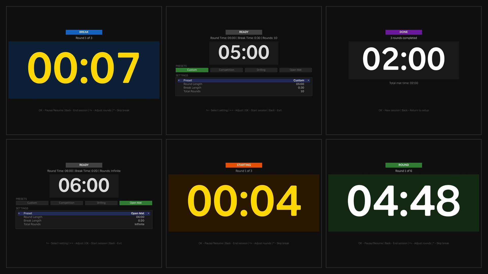
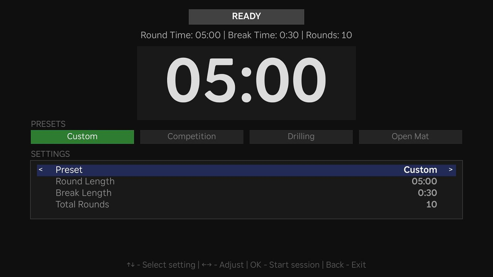
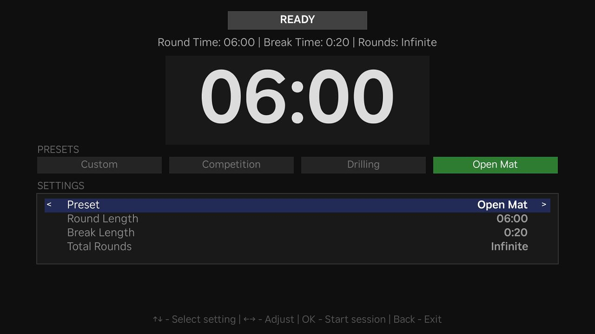
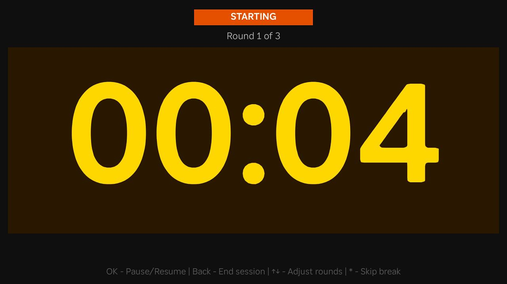
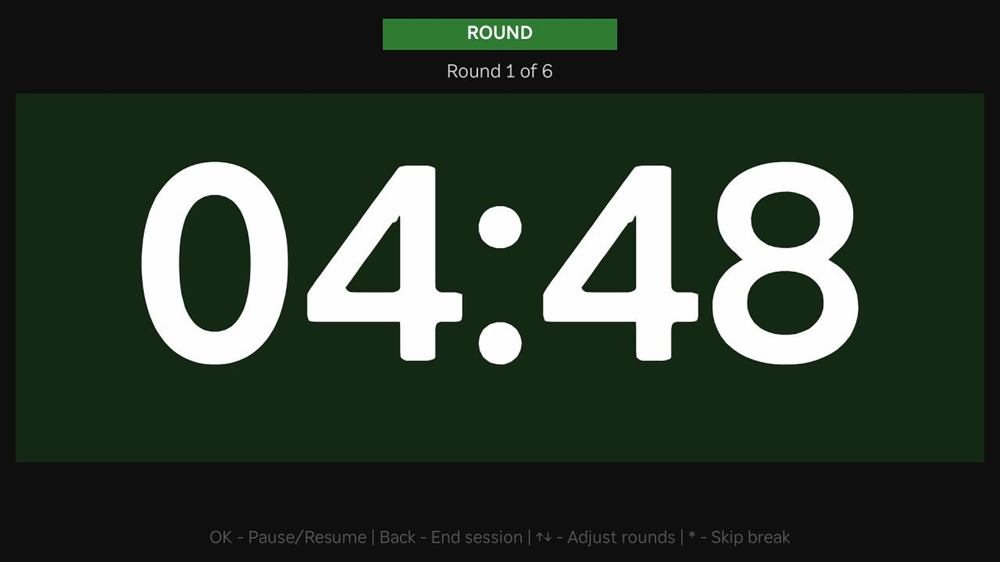
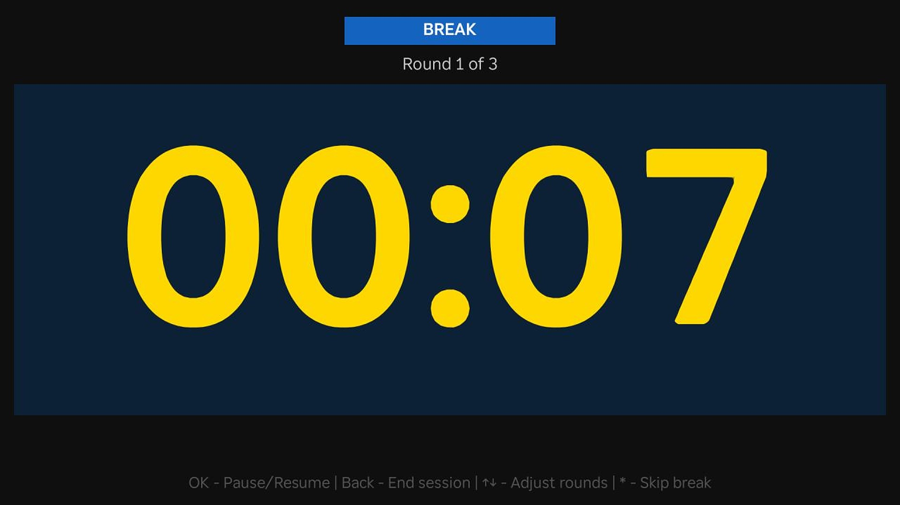
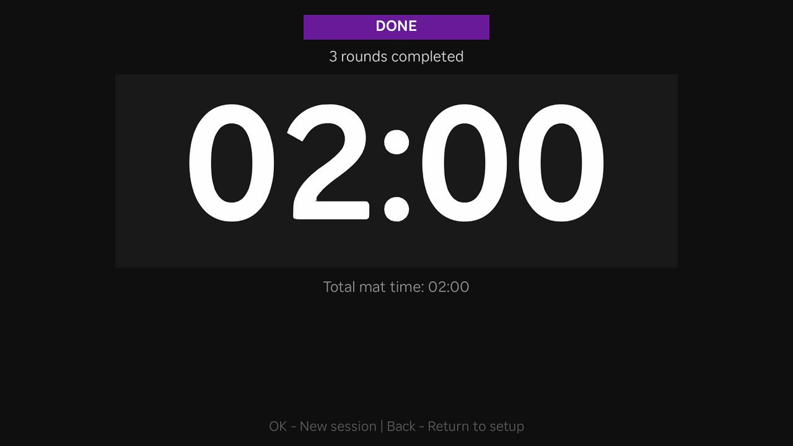

# BJJ Timer: Jiu Jitsu Clock

A simple Brazilian Jiu-Jitsu round timer for Roku.

BJJ Timer helps practitioners run training sessions, drilling rounds, open mats, and competition-style rounds directly from their Roku device.

## Features

* Adjustable round length
* Adjustable break length
* Pre-round countdown
* Single-round and unlimited-round sessions
* Pause and resume support
* Training presets
* Large, easy-to-read timer display
* Roku remote friendly controls

## Screenshots

### Setup

Choose a preset or customize round length, break length, and total rounds.

### Session flow

Pre-round countdown, active round, break, and session summary.

## Privacy

The application does not collect, store, or transmit personal information.

See [PRIVACY.md](PRIVACY.md).

## Terms

See [TERMS.md](TERMS.md).

## Developer

Created by Robert Sima.

GitHub: https://github.com/robertsima
